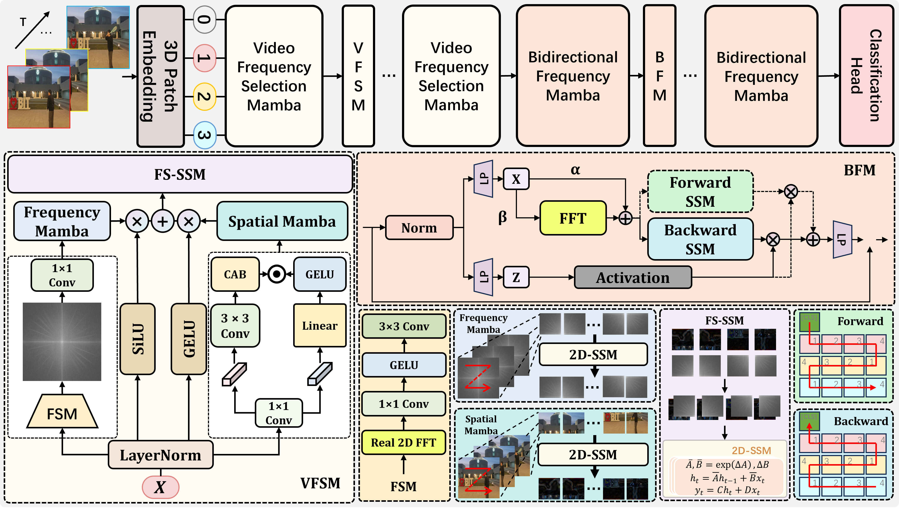

# A Unified RGB-Wavelet Dual-Domain Framework for Visual Representation Learning

We propose a novel unified dual-domain framework, named RWT, which jointly exploits RGB and wavelet domain representations to capture both global dependencies as well as localized frequency information. 

In the RGB domain, multi-head self-attention is employed to extract long-range interactions, 

while in the wavelet domain, Discrete Wavelet Transform (DWT) facilitates invertible downsampling by decomposing images into low-frequency (structural) and high-frequency (textural) components, 

which are then processed via depthwise separable convolutions.<br />

<p align="center">
    
    <br />
</p>

```
class VisionMamba(nn.Module):
    def __init__(
            self, 
            img_size=224, 
            patch_size=16, 
            depth=24, 
            embed_dim=192, 
            channels=3, 
            num_classes=1000,
            drop_rate=0.,
            drop_path_rate=0.1,
            ssm_cfg=None, 
            norm_epsilon=1e-5, 
            initializer_cfg=None,
            fused_add_norm=True,
            rms_norm=True, 
            residual_in_fp32=True,
            bimamba=True,
            # video
            kernel_size=1, 
            num_frames=8, 
            fc_drop_rate=0., 
            device=None,
            dtype=None,
            # checkpoint
            use_checkpoint=False,
            checkpoint_num=0,
        ):
        factory_kwargs = {"device": device, "dtype": dtype} # follow MambaLMHeadModel
        super().__init__()
        self.residual_in_fp32 = residual_in_fp32
        self.fused_add_norm = fused_add_norm
        self.use_checkpoint = use_checkpoint
        self.checkpoint_num = checkpoint_num
        print(f'Use checkpoint: {use_checkpoint}')
        print(f'Checkpoint number: {checkpoint_num}')

        # pretrain parameters
        self.num_classes = num_classes
        self.d_model = self.num_features = self.embed_dim = embed_dim  # num_features for consistency with other models

        self.patch_embed = PatchEmbed(
            img_size=img_size, patch_size=patch_size, 
            kernel_size=kernel_size,
            in_chans=channels, embed_dim=embed_dim
        )
        num_patches = self.patch_embed.num_patches

        self.cls_token = nn.Parameter(torch.zeros(1, 1, self.embed_dim))
        self.pos_embed = nn.Parameter(torch.zeros(1, num_patches + 1, self.embed_dim))
        self.temporal_pos_embedding = nn.Parameter(torch.zeros(1, num_frames // kernel_size, embed_dim))
        self.pos_drop = nn.Dropout(p=drop_rate)

        self.head_drop = nn.Dropout(fc_drop_rate) if fc_drop_rate > 0 else nn.Identity()
        self.head = nn.Linear(self.num_features, num_classes) if num_classes > 0 else nn.Identity()

        dpr = [x.item() for x in torch.linspace(0, drop_path_rate, depth)]  # stochastic depth decay rule
        inter_dpr = [0.0] + dpr
        self.drop_path = DropPath(drop_path_rate) if drop_path_rate > 0. else nn.Identity()
        # mamba blocks
        self.layers = nn.ModuleList(
            [
                create_block(
                    embed_dim,
                    ssm_cfg=ssm_cfg,
                    norm_epsilon=norm_epsilon,
                    rms_norm=rms_norm,
                    residual_in_fp32=residual_in_fp32,
                    fused_add_norm=fused_add_norm,
                    layer_idx=i,
                    bimamba=bimamba,
                    drop_path=inter_dpr[i],
                    **factory_kwargs,
                )
                for i in range(depth)
            ]
        )
        
        # output head
        self.norm_f = (nn.LayerNorm if not rms_norm else RMSNorm)(embed_dim, eps=norm_epsilon, **factory_kwargs)

        # original init
        self.apply(segm_init_weights)
        self.head.apply(segm_init_weights)
        trunc_normal_(self.pos_embed, std=.02)

        # mamba init
        self.apply(
            partial(
                _init_weights,
                n_layer=depth,
                **(initializer_cfg if initializer_cfg is not None else {}),
            )
        )
        # ========== 频域融合参数 ==========
        self.freq_alpha = nn.Parameter(torch.tensor(1.0))  # spatial weight
        self.freq_beta = nn.Parameter(torch.tensor(0.1))   # frequency weight
        self.freq_fusion_layers = 8  # 只在前8层使用频域融合
        # =================================

    def allocate_inference_cache(self, batch_size, max_seqlen, dtype=None, **kwargs):
        return {
            i: layer.allocate_inference_cache(batch_size, max_seqlen, dtype=dtype, **kwargs)
            for i, layer in enumerate(self.layers)
        }

    @torch.jit.ignore
    def no_weight_decay(self):
        return {"pos_embed", "cls_token", "temporal_pos_embedding"}
    
    def get_num_layers(self):
        return len(self.layers)

    @torch.jit.ignore()
    def load_pretrained(self, checkpoint_path, prefix=""):
        _load_weights(self, checkpoint_path, prefix)

    def forward_features(self, x, inference_params=None):
        num_frames = 16
        x = self.patch_embed(x)
        B, C, T, H, W = x.shape
        x = x.permute(0, 2, 3, 4, 1).reshape(B * T, H * W, C)

        cls_token = self.cls_token.expand(x.shape[0], -1, -1)  # stole cls_tokens impl from Phil Wang, thanks
        x = torch.cat((cls_token, x), dim=1)
        x = x + self.pos_embed

        # temporal pos
        cls_tokens = x[:B, :1, :]
        x = x[:, 1:]
        x = rearrange(x, '(b t) n m -> (b n) t m', b=B, t=T)
        x = x + self.temporal_pos_embedding
        x = rearrange(x, '(b n) t m -> b (t n) m', b=B, t=T)
        x = torch.cat((cls_tokens, x), dim=1)

        x = self.pos_drop(x)

        # mamba impl
        residual = None
        hidden_states = x
        for idx, layer in enumerate(self.layers):
            # ========== 频域融合（前N层） ==========
            if idx < self.freq_fusion_layers:
                # 分离 cls 和 patch tokens
                cls_tok = hidden_states[:, :1, :]       # [B, 1, C]
                patch_tokens = hidden_states[:, 1:, :]  # [B, T*H*W, C]

                B, L_patch, C = patch_tokens.shape
                T_vid = num_frames // self.patch_embed.tubelet_size  # e.g., 8 // 1 = 8
                H_patch = W_patch = int((L_patch // T_vid) ** 0.5)   # e.g., 14 for 224/16

                # Reshape to [B, T, H, W, C]
                patches_3d = patch_tokens.view(B, T_vid, H_patch, W_patch, C)

                # 对每个 frame 做 2D FFT (on H, W)
                patches_fft = torch.fft.fft2(patches_3d, dim=(-2, -1), norm='ortho')
                amp = torch.abs(patches_fft)  # [B, T, H, W, C]

                # 可学习加权融合: α * spatial + β * freq
                fused = self.freq_alpha * patches_3d + self.freq_beta * amp

                # Flatten back to [B, T*H*W, C]
                fused_flat = fused.view(B, T_vid * H_patch * W_patch, C)

                # 拼回 cls token
                hidden_states = torch.cat([cls_tok, fused_flat], dim=1)
            # =====================================
            if self.use_checkpoint and idx < self.checkpoint_num:
                hidden_states, residual = layer(
                    hidden_states, residual, inference_params=inference_params,
                    use_checkpoint=True
                )
            else:
                hidden_states, residual = layer(
                    hidden_states, residual, inference_params=inference_params
                )

        if not self.fused_add_norm:
            if residual is None:
                residual = hidden_states
            else:
                residual = residual + self.drop_path(hidden_states)
            hidden_states = self.norm_f(residual.to(dtype=self.norm_f.weight.dtype))
        else:
            # Set prenorm=False here since we don't need the residual
            fused_add_norm_fn = rms_norm_fn if isinstance(self.norm_f, RMSNorm) else layer_norm_fn
            hidden_states = fused_add_norm_fn(
                self.drop_path(hidden_states),
                self.norm_f.weight,
                self.norm_f.bias,
                eps=self.norm_f.eps,
                residual=residual,
                prenorm=False,
                residual_in_fp32=self.residual_in_fp32,
            )

        # return only cls token
        return hidden_states[:, 0, :]

    def forward(self, x, inference_params=None):
        x = self.forward_features(x, inference_params)
        x = self.head(self.head_drop(x))
        return x
```

You can get the pretrained model from [BaiduNetDisk](https://pan.baidu.com/s/1MfSyWvn4EjBqTHSMn_RFiA?pwd=rb7z)  Extraction code：rb7z

## Contents

- [Directory Structure](#directory-structure)
- [Acknowledgements](#acknowledgements)


## Directory Structure

```
├── LICENSE.txt
├── README.md
```

### Acknowledgements


- [Deep Learning for Image Processing](https://github.com/WZMIAOMIAO/deep-learning-for-image-processing)

<!-- links -->
